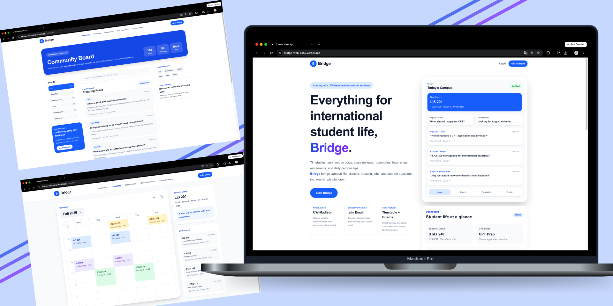

## 『Bridge』 _An international student onboarding and community platform_ 

  

Built by <strong>Raein Seo</strong>

  
📩 rein0ju06@gmail.com

  

🔗 <a href="https://www.linkedin.com/in/raein-seo" target="_blank"><b>LinkedIn</b></a> / 
<a href="https://instagram.com/rein_seo" target="_blank"><b>Instagram</b></a> / <a href="https://www.figma.com/design/ysMQywgZViL0WCJuzV10FX/Bridge?node-id=44-619&p=f&t=N8HoSK92IuDgbCiG-0" target="_blank"><b>Figma</b></a>

   

<blockquote>
  <strong>Project Evolution</strong> 
  Bridge started as a UX/UI case study in Figma and later expanded into early web and iOS prototypes. 
   
  → <a href="https://github.com/rein0ju/bridge">UX/UI Case Study</a>
   
  → <a href="https://github.com/rein0ju/bridge-web">Web Prototype</a>
   
   → <a href="https://github.com/rein0ju/bridge-ios">iOS Prototype</a>
</blockquote>

       
   

### Bridge Web is an early web prototype of Bridge, an international student onboarding and community platform. <a href="https://bridge-web-ashy.vercel.app" target="_blank"> [Bridge Web Prototype] </a>

### Tech Stack

